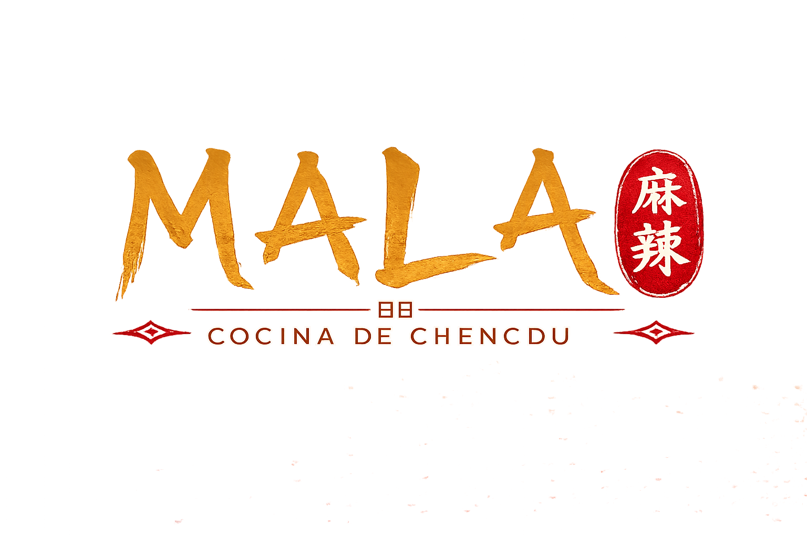

  

<h1 align="center">🍜 MALA - Cocina de Chengdu</h1>

  <strong>Una experiencia digital inspirada en la auténtica gastronomía de Chengdu, China.</strong>

  Proyecto desarrollado para la <strong>Hackathon #1 de Generation Colombia</strong>.

---

# 📖 Descripción

**MALA - Cocina de Chengdu** es una propuesta de sitio web desarrollada para representar la identidad visual y gastronómica de un restaurante especializado en la cocina tradicional de Chengdu, una de las ciudades más importantes de la provincia de Sichuan, China.

El proyecto nace con el propósito de crear una experiencia digital que combine la riqueza cultural de la gastronomía china con una interfaz moderna, elegante y totalmente responsive. Más que presentar un menú, buscamos que cada visitante sienta que está entrando a un restaurante premium desde el primer momento en que accede al sitio.

Este proyecto fue desarrollado durante la **Hackathon #1 de Generation Colombia**, un reto donde el equipo trabajó de manera colaborativa aproximadamente desde las **9:00 a.m. hasta las 5:30 p.m.**, pasando por las etapas de investigación, diseño, maquetación y desarrollo del producto.

---

# 🍲 ¿Por qué "MALA"?

El nombre **MALA (麻辣)** representa uno de los sabores más emblemáticos de la gastronomía de Sichuan.

- **麻 (Má)** representa el característico efecto de adormecimiento producido por la pimienta de Sichuan.
- **辣 (Là)** representa el picante intenso propio de esta cocina.

La combinación de ambos da origen al famoso sabor **Mala**, reconocido internacionalmente por su intensidad, equilibrio y personalidad.

Elegimos este nombre porque refleja la esencia del restaurante y transmite inmediatamente la identidad culinaria que queremos representar.

---

# 🎨 Concepto de Diseño

La propuesta visual fue inspirada en restaurantes asiáticos contemporáneos, buscando un equilibrio entre tradición y modernidad.

Cada decisión de diseño fue pensada para transmitir:

- Elegancia
- Exclusividad
- Tradición
- Cultura
- Sofisticación
- Experiencia premium

La identidad visual utiliza una paleta basada en los colores tradicionales chinos:

- 🔴 Rojo → Pasión, tradición y buena fortuna.
- 🟡 Dorado → Calidad, lujo y excelencia.
- ⚫ Negro → Elegancia y modernidad.
- ⚪ Tonos claros → Contraste y legibilidad.

---

# 🍽️ Experiencia del Usuario

MALA fue concebido para que el usuario pueda descubrir el restaurante de forma sencilla e intuitiva.

La plataforma ofrece una navegación clara que permite:

- Conocer la historia del restaurante.
- Descubrir la cultura gastronómica de Chengdu.
- Explorar un catálogo de platos tradicionales.
- Visualizar imágenes de cada preparación.
- Consultar precios.
- Agregar productos al carrito de compras.
- Gestionar el pedido mediante un carrito lateral.
- Navegar cómodamente desde cualquier dispositivo gracias al diseño responsive.

Nuestro objetivo fue crear una experiencia cercana a la que ofrece un restaurante moderno, donde la presentación visual de los platos tiene un papel fundamental en la decisión del cliente.

---

# 🎯 Objetivo

Desarrollar una interfaz web moderna que represente un restaurante especializado en gastronomía china, aplicando principios de diseño UI/UX y buenas prácticas de desarrollo Front-End para ofrecer una experiencia visual atractiva, intuitiva y responsive.

---

# 🚀 Funcionalidades

Actualmente el proyecto incorpora:

- ✅ Navbar responsive.
- ✅ Diseño completamente adaptable.
- ✅ Catálogo de platos.
- ✅ Carrito de compras lateral.
- ✅ Componentes reutilizables.
- ✅ Interfaz moderna inspirada en restaurantes premium.
- ✅ Código organizado y documentado.
- ✅ Base preparada para integrar funcionalidades dinámicas mediante JavaScript.

---

# 🛠 Tecnologías

- HTML5
- CSS3
- Bootstrap 5
- JavaScript ES6

---

# 👥 Equipo de Desarrollo

Proyecto realizado por:

- **Miguel Ángel Ospina Rúa**
- **Monica Jazmmin Diaz**
- **Dannis Dayana Rincon**
- **Michael Espinal**
- **Kevin Soto**

---

# 🏆 Hackathon #1 - Generation Colombia

Este proyecto fue desarrollado durante la **Hackathon #1 de Generation Colombia**, una jornada intensiva donde el equipo trabajó aproximadamente desde las **9:00 a.m. hasta las 5:30 p.m.**

Durante este reto aplicamos principios de diseño de interfaces, desarrollo Front-End, organización del trabajo y colaboración constante para construir una propuesta funcional dentro del tiempo establecido.

Más allá de desarrollar una página web, nuestro propósito fue diseñar una experiencia digital que representara la identidad de un restaurante real, cuidando cada detalle visual y la interacción con el usuario.

---

# 🌱 Aprendizajes

La Hackathon nos permitió fortalecer habilidades como:

- Trabajo colaborativo.
- Comunicación efectiva.
- Gestión del tiempo.
- Resolución de problemas.
- Diseño UI.
- Experiencia de Usuario (UX).
- Desarrollo Front-End.
- Organización y documentación del código.

---

# 📄 Licencia

Proyecto desarrollado con fines académicos para la **Hackathon #1 de Generation Colombia**.